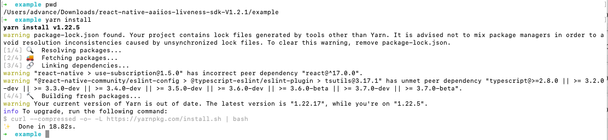
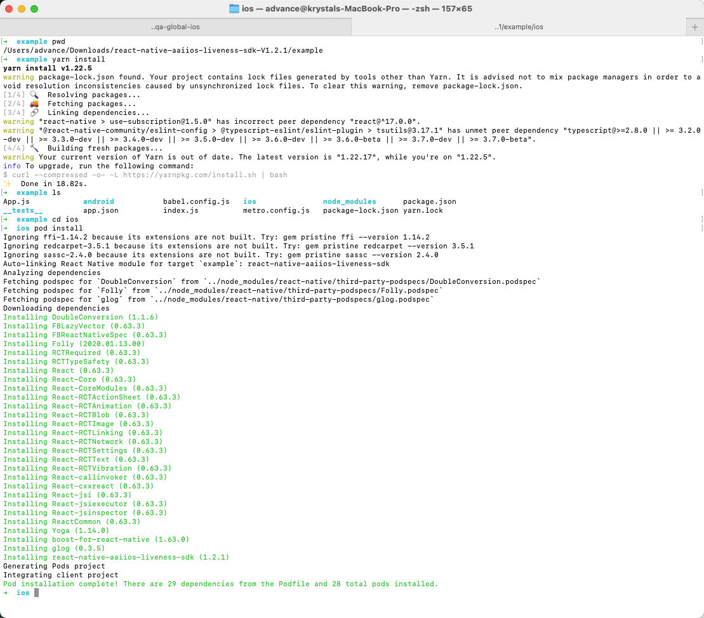
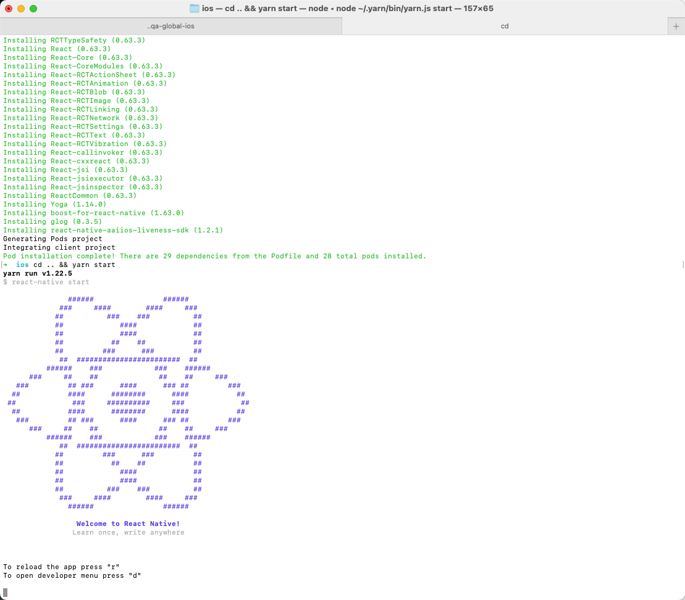
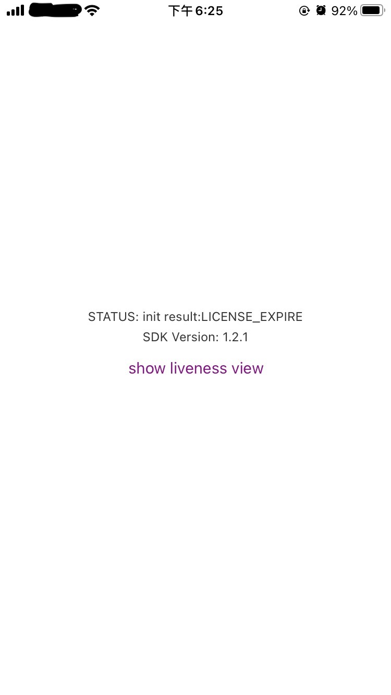
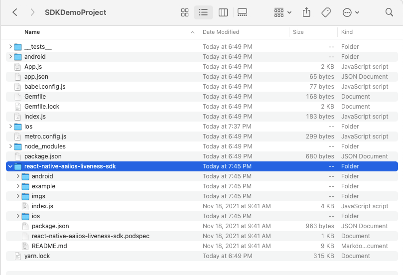
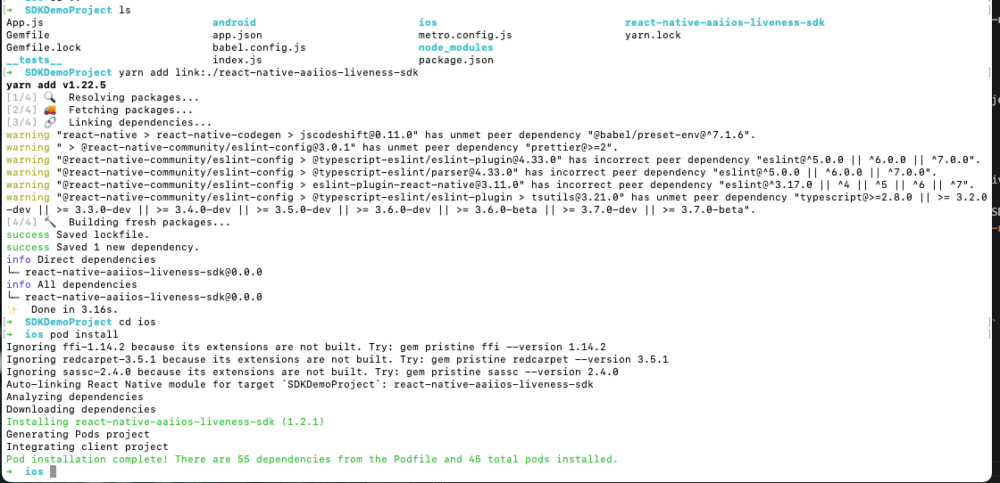
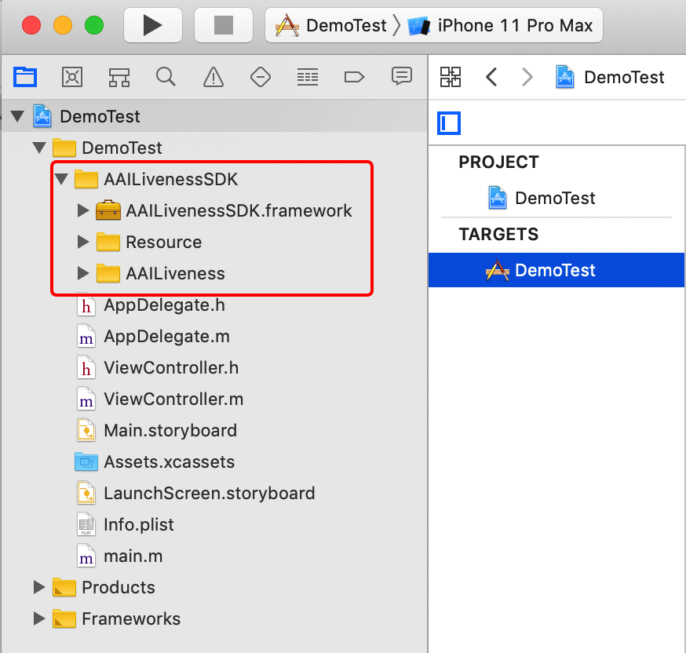
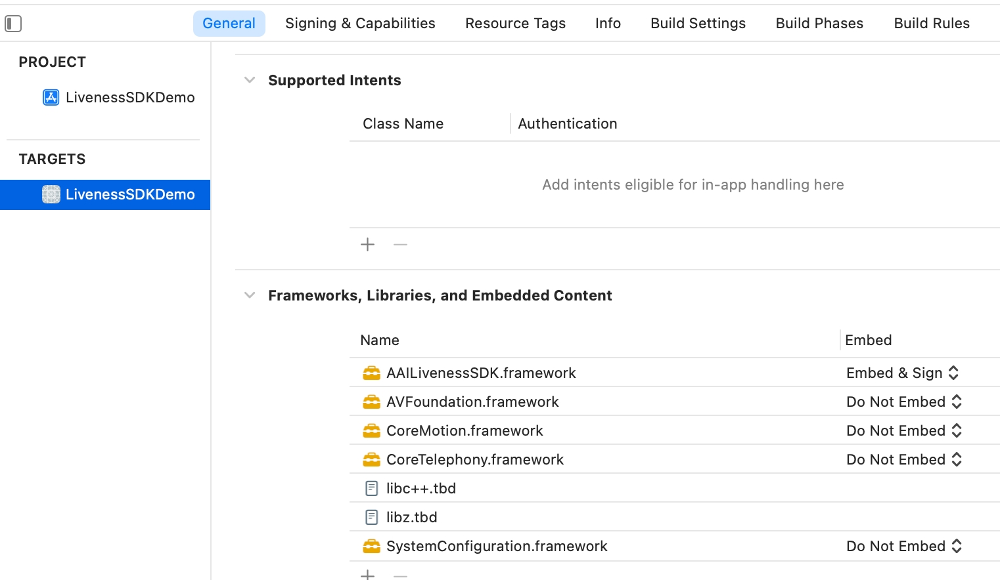

# react-native-aaiios-liveness-sdk(v1.2.9)

## Running the example app

1. Go into the example directory:
    `cd example`
2. Install packages:
    `yarn install`
    <div></div>
3. Go into the `ios` subdirectory and install pod dependencies:
    `cd ios && pod install`
    <div></div>
4. Go into the example directory and start Metro:
    `cd .. && yarn start`
    <div></div>
5. Modify `example/App.js` to specify your market and license content(The license content is obtained by your server calling our openapi).
   ```
   NativeModules.RNAAILivenessSDK.initWithMarket("your-market")
   
   let licenseStr = "your-license-content"
   NativeModules.RNAAILivenessSDK.configLicenseAndCheck(licenseStr, (result) => {
       ...
   })
   ```
6. run example app:
    `react-native run-ios` or open `example.xcworkspace` in Xcode and run.
    <div></div>

## Getting started (react-native >= 0.60)

If your react-navive version >= 0.60, you can refer this part to intergrate `react-native-aaiios-liveness-sdk`.

1. First rename the folder name `react-native-aaiios-liveness-sdk-V{sdkversion}` to `react-native-aaiios-liveness-sdk`, then we can try to integrate the SDK. There are two ways to integrate the SDK:
 
    * As local package:
      1. Put the `react-native-aaiios-liveness-sdk` folder to your react-native project.
        <div></div>

      2. cd your react-native project root path and link this local sdk package.
        `yarn add link:./react-native-aaiios-liveness-sdk`

    * As remote package:
      1. Upload all files in `react-native-aaiios-liveness-sdk` folder to your private git repository, make sure the name of your repository is `react-native-aaiios-liveness-sdk`.
      2. Navigate to the root directory of your react-native project and install SDK.
        `$ npm install git+ssh://git@{your-git-domain}:{your-git-user-name}/react-native-aaiios-liveness-sdk.git --save`

3. After integrate the SDK then we link SDK to iOS project.

    `cd ios && pod install`
    <div></div>

4. Then add camera and motion sensor (gyroscope) usage description in `Info.plist` as bellow. Ignore this step if you have added those.
   
   ```xml
   <key>NSCameraUsageDescription</key>
   <string>Use the camera to detect the face movements</string>
   <key>NSMotionUsageDescription</key>
   <string>Use the motion sensor to get the phone orientation</string>
   ```

## Getting started (react-native < 0.60)

1. In Xcode, add `ios/AAILivenessSDK` folder to your project.
    
    <div></div>
    
2. In Xcode, choose "TARGETS -> General" add the following system libraries and frameworks in the `Frameworks, Libraries, and Embedded Content` section:
   - `libz.tbd`
   - `libc++.tbd`
   - `AVFoundation.framework`
   - `CoreMotion.framework`
   - `SystemConfiguration.framework`
   - `CoreTelephony.framework`

<div></div>

3. In Xcode, add camera and motion sensor (gyroscope) usage description in `Info.plist` as bellow. Ignore this step if you have added those.
   
   ```xml
   <key>NSCameraUsageDescription</key>
   <string>Use the camera to detect the face movements</string>
   <key>NSMotionUsageDescription</key>
   <string>Use the motion sensor to get the phone orientation</string>
   ```

4. Rename `index.js` to `AAIIOSLivenessView.js`, then add this `js` file to your react native project.

## Usage

```javascript
import React, { Component } from 'react';
import {StyleSheet, Text, View, Button, NativeModules} from 'react-native';
// 1. Import SDK (react-native >= 0.60)
import AAIIOSLivenessView from 'react-native-aaiios-liveness-sdk';
// Import SDK (react-native < 0.60)
//import AAIIOSLivenessView from '{your AAIIOSLivenessView.js path}';

export default class App extends Component<{}> {
  state = {
    message: '--',
    version: '',
    rootPage: true,
    sdkInitSuccess: false
  };

  constructor(props) {
    super(props);
    
    // Step 1. Init SDK
    /*
    Market available value are as follows:

    AAILivenessMarketIndonesia
    AAILivenessMarketIndia
    AAILivenessMarketPhilippines
    AAILivenessMarketVietnam
    AAILivenessMarketThailand
    AAILivenessMarketMexico
    AAILivenessMarketMalaysia
    AAILivenessMarketPakistan
    AAILivenessMarketNigeria
    AAILivenessMarketColombia
    AAILivenessMarketSingapore
    */

    // There are several ways to initialize the SDK
    /*
    // Option 1(NOT RECOMMENDED): Using accessKey and secretKey:
    // NativeModules.RNAAILivenessSDK.init("your-access-key", "your-secret-key", "your-market")
    */

    /*
    // Option 2 (recommended, but only for customers with global services enabled): Using license
    // 
    // NativeModules.RNAAILivenessSDK.initWithMarketAndGlobalService("your-market", isGlobalService ? true: false)
    */

    /*
    // Option 3 (recommended, for most customers): Using license
    NativeModules.RNAAILivenessSDK.initWithMarket("your-market")
    */
    // e.g.
    NativeModules.RNAAILivenessSDK.initWithMarket("AAILivenessMarketIndonesia")
    
    /*
    // Set whether to detect face occlusion. The default value is NO.
    // Note face occlusion detection only in the preparation phase,
    // not in the action detection phase
    NativeModules.RNAAILivenessSDK.configDetectOcclusion(true)
    */

    /*
    // Set the size(width) of `img` when method `onDetectionComplete` is called.
    // Image size(width) should be in range [300, 1000], default image size(width) is 600(600x600).
    NativeModules.RNAAILivenessSDK.configResultPictureSize(600)
     */
    
    /*
    // Set to detect face occlusion.
    NativeModules.RNAAILivenessSDK.configDetectOcclusion(true)
    */

    /*
    // Set action detection time interval. Default is 10s.
    // Note that this value represents the timeout for an action, 
    // not the total timeout for all actions.
    NativeModules.RNAAILivenessSDK.configActionTimeoutSeconds(10)
    */

    /*
    // User binding (strongly recommended).
    // You can use this method to pass your user unique identifier to us, 
    // we will establish a mapping relationship based on the identifier。
    // It is helpful for us to check the log when encountering problems.
    NativeModules.RNAAILivenessSDK.configUserId("your user id")
    */
  }

  componentDidMount() {
    // Get SDK version
    NativeModules.RNAAILivenessSDK.sdkVersion((message) => {
      this.setState({
        version: message,
      });
    });

    // Step 2. Configure your license(your server needs to call openAPI to obtain license content)
    NativeModules.RNAAILivenessSDK.configLicenseAndCheck("your-license-content", (result) => {
      this.setState({
        message: "init result:" + result,
        sdkInitSuccess: (result === "SUCCESS")
      });
    })
  }

  render() {
    if (this.state.rootPage || !this.state.sdkInitSuccess) {
      return <View style={styles.container}>
              <Text style={styles.instructions}>STATUS: {this.state.message}</Text>
              <Text style={styles.instructions}>SDK Version: {this.state.version}</Text>
              <Button
                onPress={()=> {
                  this.setState({
                    rootPage: false
                  })
                }}
                title="show liveness view"
                color="#841584"
              />
      </View>
    } else {
      // Step 3. Configure callback
      /*
      For `livenessViewBeginRequest` and `livenessViewEndRequest`, 
      these two methods are only used to tell you that the SDK is going to start sending network requests and end network requests, 
      and are usually used to display and close the loadingView, that is,  if you pass showHUD={false}, then you should in method `livenessViewBeginRequest` to show your customized loading view
      and close loading view in method `livenessViewEndRequest`. If you pass showHUD={true}, then you do nothing in these two methods.


      For onDetectionFailed:
      The error types are as follows, and the corresponding error messages are in the language file of the `Resource/AAILanguageString.bundle/id.lproj/Localizable.strings` (depending on the language used by the phone)

      fail_reason_prepare_timeout
      fail_reason_timeout
      fail_reason_muti_face
      fail_reason_facemiss_blink_mouth
      fail_reason_facemiss_pos_yaw
      fail_reason_much_action

      In fact, for the type of error this function gets, you don't need to pay attention to it, just prompt the error message and let the user retry.

      For onLivenessViewRequestFailed, this mean sdk request failed, it may be that the network is not available, or account problems, or server errors, etc. 
      You only need to pay attention to the `errorMessage` and `transactionId`, `transactionId` can be used to help debug the specific cause of the error, generally just prompt the errorMessage.
      */
      return <AAIIOSLivenessView 
              showHUD={true}
              style={styles.sdkContent}

              /*
              /// Optional
              /// Specify which language to use for the SDK. If this value is not set,
              /// the system language will be used by default. If the system language is not supported,
              /// English will be used.
              ///
              /// The languages currently supported by sdk are as follows:
              /// 
              /// "en" "id"  "vi"  "zh-Hans"  "th"  "es"  "ms" "hi"
              language={"en"}
              */
              
              /*
              /// Optional
              /// Set the timeout for prepare stage, default is 10s.
              ///
              /// This value refers to the time from when the sdk page is displayed to when the motion detection is ready.
              /// For example, after the sdk page is presented, if the user does not hold the phone upright or put the face in the detection area,
              /// and continues in this state for a certain period of time, then the `onDetectionFailed` will be called,
              /// and the value of the "errorCode" is "fail_reason_prepare_timeout".
              prepareTimeoutInterval={10}
              */

              {/* Optional */}
              onCameraPermissionDenied={(errorKey, errorMessage) => {
                console.log(">>>>> onCameraPermissionDenied", errorKey, errorMessage)
                this.setState({
                  rootPage: true,
                  message: errorMessage
                })
              }}

              {/* Optional */}
              livenessViewBeginRequest={() => {console.log(">>>>> livenessViewBeginRequest")}}

              {/* Optional */}
              livenessViewEndRequest={() => {console.log(">>>>> livenessViewEndRequest")}}

              {/* Required */}
              onDetectionComplete={(livenessId, base64Img) => {
                console.log(">>>>> onDetectionComplete:", livenessId)
                /*
                You need to give the livenessId to your server, then your server will call the anti-spoofing api to get the score of this image.
                The base64Img size is 600x600.
                */
                this.setState({
                  rootPage: true,
                  message: livenessId
                })
              }}

              {/* Optional */}
              onDetectionFailed={(errorCode, errorMessage) => {
                console.log(">>>>> onDetectionFailed:", errorCode, errorMessage)
                this.setState({
                  rootPage: true,
                  message: errorMessage
                })
              }}

              {/* Optional */}
              onLivenessViewRequestFailed={(errorCode, errorMessage, transactionId) => {
                console.log(">>>>> onLivenessViewRequestFailed:", errorCode, errorMessage, transactionId)
                this.setState({
                  rootPage: true,
                  message: errorMessage
                })
              }}
            >
          </AAIIOSLivenessView>
    }
  }
}


const styles = StyleSheet.create({
  container: {
    flex: 1,
    justifyContent: 'center',
    alignItems: 'center',
    backgroundColor: '#FFFFFF',
  },
  instructions: {
    textAlign: 'center',
    color: '#333333',
    marginBottom: 5,
  },
  sdkContent: {
    flex: 1,
    justifyContent: 'center',
    alignItems: 'center',
    backgroundColor: '#FFFFFF',
  }
});

```

## Props

| Prop | Default | Type | Description |
| :--: | :--: | :--: | :--: |
|showHUD|true|bool|This property is used to control whether to show the default loading view when sending a network request|
|detectionActions|[]|string array|Sequence of actions detected. eg: `["AAIDetectionTypeMouth", "AAIDetectionTypeBlink", "AAIDetectionTypePosYaw"]`. Default the order of the first two actions is random and the last action type is `AAIDetectionTypePosYaw`. You can also specify the motion detection sequence yourself, as the sequence and number are not fixed. |

### Release Logs

#### v1.2.0
1. Support to initialize SDK with license.
    ```js
    NativeModules.RNAAILivenessSDK.initWithMarket("your-market")
    
    NativeModules.RNAAILivenessSDK.configLicenseAndCheck("your-license-content", (result) => {
      if (result === "SUCCESS") {
        // SDK init success
      }
    })
    ```
2. Support face occlusion detection(only in the preparation phase, not in the action detection phase), this feature is off by default, you can turn it on if needed.

    ```js
    NativeModules.RNAAILivenessSDK.configDetectOcclusion(true)
    ```
3. Support Mexico,Malaysia,Pakistan,Nigeria,Colombia.

#### v1.2.1
1. Fix the bug that img of AAILivenessResult may be nil when the onDetectionComplete: method is called.

### v1.2.8
1. Upgrade network module.

### v1.2.9
1. Support setting `language` and `prepareTimeoutInterval`.

### v1.2.9.1
1. Fixed the bug that the audio could not be automatically switched with the language.